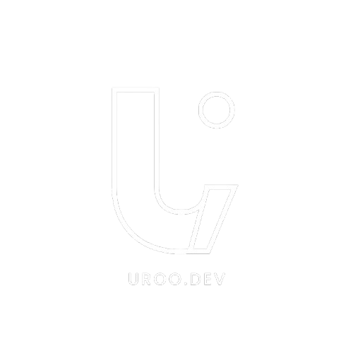

# uroo.dev



**Uroo.dev** — Turning ideas into digital products that improve business efficiency.

A modern, responsive portfolio website for a small Indonesian software house specializing in digital solutions for startups and UMKM (Small-to-Medium Enterprises).

---

## Pages

| Page | File | Description |
|---|---|---|
| **Beranda** | `index.html` | Homepage with hero video, stat counters, services overview, portfolio carousel, testimonials, FAQ, and CTA |
| **Layanan** | `services.html` | Service offerings: Web Dev, Mobile Dev, UI/UX Design, Maintenance & Support |
| **Portofolio** | `portfolio.html` | Filterable project gallery with 16+ showcased projects |
| **Tentang** | `about.html` | Company vision, mission, core values, team info, and workspace gallery |
| **Kontak** | `contact.html` | Inquiry form, location, contact info, and social media links |

---

## Tech Stack

| Technology | Usage |
|---|---|
| **HTML5** | Semantic markup, Open Graph, JSON-LD structured data |
| **Tailwind CSS v3** | Utility-first styling (CDN via `cdn.tailwindcss.com`) |
| **Custom CSS** | Glassmorphism, coverflow carousel, FAQ accordion, reduced-motion fallbacks (`css/style.css`) |
| **Google Fonts (Inter)** | Typography (400–700 weight) |
| **Material Symbols** | Icon system (variable font icons) |
| **GSAP 3.12.5** | Scroll-triggered animations, number counters, parallax/tilt effects |
| **Lenis 1.1.13** | Smooth scrolling, integrated with GSAP ScrollTrigger |
| **FormSubmit.co** | Contact form backend (email delivery) |
| **Google Maps** | Embedded location map in footer & contact page |

---

## Features

- **Video Hero Background** — Full-width video with gradient overlay on the homepage
- **Animated Stat Counters** — Number counters triggered on scroll (50+ projects, 20+ clients, etc.)
- **3D Coverflow Carousel** — Interactive project showcase with keyboard navigation, auto-play, and pause on hover
- **Filterable Portfolio Grid** — Toggle between All, Tugas, Mandiri, and Project categories
- **Infinite Testimonial Marquee** — Auto-scrolling client testimonials with hover pause
- **FAQ Accordion** — Expandable questions section
- **Parallax Tilt Effect** — Mouse-driven 3D tilt on CTA card and hero image
- **Responsive Design** — Mobile off-canvas menu, adaptive layouts across all breakpoints
- **Dark Mode** — Consistent dark theme throughout (`#131313` palette)
- **Smooth Scrolling** — Powered by Lenis
- **SEO Optimized** — Canonical URLs, Open Graph tags, JSON-LD structured data per page
- **Accessibility** — `aria-label` attributes, `focus-visible` outlines, `prefers-reduced-motion` support

---

## Project Structure

```
uroo.dev/
├── index.html              # Homepage (Beranda)
├── about.html              # About page (Tentang)
├── contact.html            # Contact page (Kontak)
├── portfolio.html          # Portfolio page (Portofolio)
├── services.html           # Services page (Layanan)
├── css/
│   └── style.css           # Custom styles
├── assets/
│   ├── Uroo.dev.png        # Logo (with background)
│   ├── Uroo.dev-bening.png # Logo (transparent)
│   ├── bg-uroo.mp4         # Hero background video
│   ├── about.jpeg          # About section image
│   ├── ceo.jpeg            # CEO portrait photo
│   ├── project.jpeg        # Generic project image
│   └── kerjakami/          # Team workspace photos
└── README.md
```

---

## Getting Started

Since this is a pure static site (no build tools or bundlers), you can simply open any HTML file in a browser:

```bash
# Clone the repository
git clone https://github.com/uroo-dev/uroo.dev.git

# Open in browser
start index.html
```

Or serve locally with any HTTP server for best results:

```bash
# Using Python
python -m http.server 8000

# Using Node.js (npx)
npx serve .
```

---

## Deployment

The site is fully static and can be deployed to any static hosting:

- **GitHub Pages**
- **Netlify**
- **Vercel**
- **Cloudflare Pages**
- Any web server (Apache, Nginx, etc.)

No build step required — just point your hosting to the repository root.

---

## Contact

- **CEO**: Dimas Euro D.P
- **Email**: [uroprasetyo@gmail.com](mailto:uroprasetyo@gmail.com)
- **WhatsApp**: [Contact via WhatsApp](https://wa.me/6281234567890)
- **LinkedIn**: [Uro Prasetyo](https://linkedin.com/in/uro-prasetyo-0479aa3a6/)
- **GitHub**: [@uroo-dev](https://github.com/uroo-dev)
- **TikTok**: [@uroo.dev](https://tiktok.com/@uroo.dev)
- **Instagram**: [@dms_euro](https://instagram.com/dms_euro)

---

## License

© 2026 uroo.dev — Studio Pengembangan Digital. All rights reserved.
